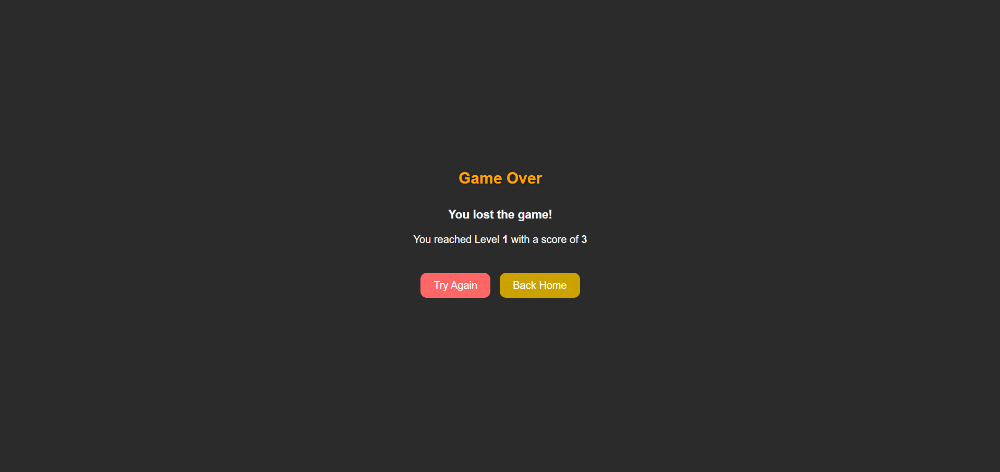

# Snake Game

#### The Snake Game is a nostalgic recreation of the classic arcade game. In this game, players control a snake that grows longer by eating apples while avoiding obstacles and colliding with itself. The goal is to score as many points as possible while navigating through increasingly challenging levels.

#### I chose this game because of its simplicity and the challenge of implementing smooth movement, collision detection, and dynamic gameplay. It was a great project to develop my coding skills and learn game logic.

## Screenshots

### Home Page

### Board Page

### Game Over Page

## Getting Started

### Play the Game

#### Click here to play the Snake Game (Replace # with your deployed game link)

## 🐍 How to Play

### Goal

- 🟥 Eat red apples to grow your snake and increase your score.
- 🟦 Avoid gray apples as they shrink your snake.

### Controls

Use the Arrow Keys to control your snake

- ⬆️ Arrow Up - Move Up
- ⬇️ Arrow Down - Move Down
- ⬅️ Arrow Left - Move Left
- ➡️ Arrow Right - Move Right

### Levels

- As you score higher, your snake moves faster, adding to the challenge.
- Each level requires reaching a specific score threshold to advance.
- The ultimate goal is to reach level 15 to win the game!

### Game Over

The game ends when:

- The snake hits an obstacle.
- The snake collides with its own body.

## Technologies Used

- JavaScript
- HTML
- CSS

## Next Steps

Here are some planned enhancements for the Snake Game:

- Leaderboard: Add a high-score tracker for players to compete.
- Difficulty Levels: Implement easy, medium, and hard difficulty modes.
- Themes: Allow players to choose different backgrounds and snake designs.
- Sound Effects: Add audio feedback for actions like eating an apple or losing.
- Multiplayer Mode: Allow two players to compete on the same game board.
